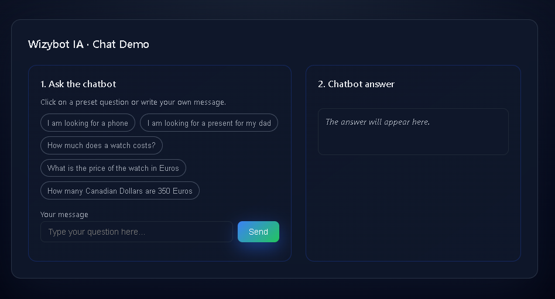

# Wizybot IA (Chat Demo)



## Purpose
Wizybot IA is a **small full-stack chatbot demo**:

- A **NestJS (TypeScript) backend** that exposes a `POST /chat` endpoint.
- A **minimal static HTML frontend** (`mini-front/`) that calls the backend and renders the answer (Markdown-safe).

The chatbot acts as a shopping assistant and can:

- **Search products** from a local CSV catalog (`src/data/products_list.csv`)
- **Convert currencies** using Open Exchange Rates
- Use **OpenAI Chat Completions + tool calling** to decide when to use those tools

## What was used (Tech Stack)
- **Backend**: Node.js + NestJS (TypeScript)
- **Validation**: `class-validator`, `class-transformer`
- **HTTP client**: `axios`
- **API docs**: Swagger (`/api`)
- **Frontend demo**: plain HTML/CSS/JS (uses `marked` + `DOMPurify` for safe Markdown rendering)
- **Hosting (demo)**: Vercel

## Requirements
- **Node.js**: recommended Node 18+ (or newer)
- **npm**: comes with Node

## Project structure (folders & files)
The actual app lives in `wizybot_ia/`.

```text
wizybotIA/
├── README.md                                    # This file
└── wizybot_ia/                                  # Main application folder
    ├── package.json                             # Dependencies & scripts
    ├── package-lock.json
    ├── tsconfig.json                            # TypeScript config
    ├── tsconfig.build.json
    ├── nest-cli.json                            # NestJS CLI config
    ├── .prettierrc                              # Code formatting
    ├── eslint.config.mjs                        # Linting rules
    ├── .gitignore
    │
    ├── mini-front/                              # Static HTML demo UI
    │   ├── index.html                           # Chat interface (calls /chat endpoint)
    │   └── styles.css                           # Modern dark theme
    │
    ├── src/                                     # Backend source code
    │   ├── main.ts                              # App entrypoint (listens on PORT or 3000)
    │   ├── app-bootstrap.ts                     # CORS + Swagger + validation pipe setup
    │   ├── app.module.ts                        # Root module (imports ChatModule)
    │   ├── app.controller.ts                    # Root controller (GET /)
    │   ├── app.service.ts
    │   │
    │   ├── chat/                                # Chat module (POST /chat)
    │   │   ├── chatModule.ts                    # Chat module definition
    │   │   ├── chatController.ts                # POST /chat endpoint
    │   │   ├── chatService.ts                   # OpenAI integration + tool calling logic
    │   │   ├── chat-request.dto.ts              # Request validation (message field)
    │   │   ├── openai.type.interface.ts         # OpenAI API types
    │   │   └── chat-tools.types.interface.ts    # Tool arguments & results types
    │   │
    │   ├── products/                            # Product catalog module
    │   │   ├── products.module.ts
    │   │   ├── products.service.ts              # CSV parsing + search logic
    │   │   └── product.interface.ts             # Product type definition
    │   │
    │   ├── currency/                            # Currency conversion module
    │   │   ├── currency.module.ts
    │   │   └── currency.service.ts              # Open Exchange Rates API integration
    │   │
    │   └── data/
    │       └── products_list.csv                # Product catalog (9 columns)
    │
    ├── test/                                    # End-to-end tests
    │   ├── app.e2e-spec.ts
    │   └── jest-e2e.json
    │
    └── scripts/
        └── copy-public.js                       # Build helper script
```

## Environment variables
This backend **requires** credentials to start (it throws on startup if missing).

Create a `.env` file inside `wizybot_ia/`:

```env

OPENAI_API_KEY=your_openai_key
OPENAI_MODEL=gpt-4.1-mini

OPEN_EXCHANGE_RATES_API_KEY=your_open_exchange_rates_key
OPEN_EXCHANGE_RATES_BASE=USD

PORT=3000

API_BASE_URL=http://....

```

## Install dependencies
Run everything from the `wizybot_ia/` folder:

```bash
cd wizybot_ia
npm install
```

## Run the backend (dev & production)
- **Development (watch mode)**:

```bash
cd wizybot_ia
npm run start:dev
```

- **Production build + start**:

```bash
cd wizybot_ia
npm run build
npm run start:prod
```

The API will be available at:
- **Local**: `http://localhost:3000`
- **Swagger UI**: `http://localhost:3000/api`

## API usage
### POST `/chat`
Send a message and receive a JSON response with the chatbot answer.

- **URL (local)**: `http://localhost:3000/chat ` 
- **Method**: `POST`
- **Headers**: `Content-Type: application/json`
- **Body**:

```json
{
  "message": "I am looking for a phone"
}
```

- **Response (example)**:

```json
{
  "answer": "..."
}

```

## Deployed demo (Vercel)
- **Frontend (chat UI)**: `https://wizybot-ia-iibp.vercel.app/`
- **Backend (API)**:
  - Chat endpoint: `https://wizybot-backend.vercel.app/`
  - Swagger UI (if enabled in deployment): `https://wizybot-backend.vercel.app/api`

## How to test in Postman (production)
Create a request:

- **Method**: `POST`
- **URL**: `https://wizybot-backend.vercel.app/chat`
- **Headers**: `Content-Type: application/json`
- **Body (raw / JSON)**:

```json
{
  "message": "I am looking for a phone"
}
```

You should receive a JSON response like:

```json
{
  "answer": "..."
}
```


## Acknowledgements
Special thanks to **Wizybot** for the opportunity and inspiration behind this demo.

yhonier Arias